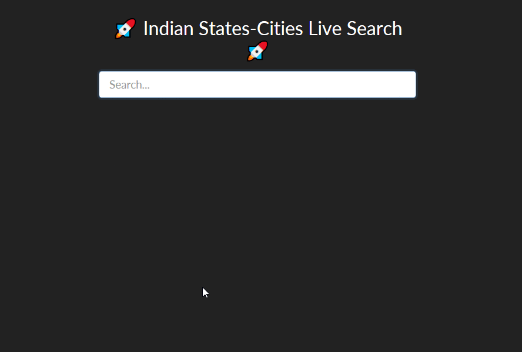

# Indian State Cities Search
This repository show cases data fetched using `fetch()` method from a JSON file and rendered on a HTML Page. For this purpose I've used a local json file having names, cities, latitude & longitude of India. 

## To Run
Run it on any server. You can use 'live-server` or `http-server` plugins in VS Code. 

This repo is jus for #PracticingJavaScript👨‍💻